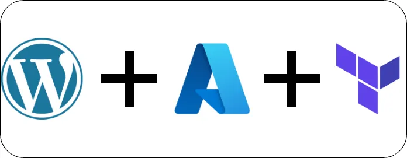
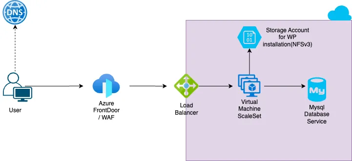

# Create a high available Wordpress website with Azure, Terraform and Github Actions
- Dan Brody
- https://github.com/dzbrody

## Introduction
One of our recent challenges was to create a highly available environment to host a WordPress multi-site application. By "highly available," we mean achieving at least 99.99% availability for the infrastructure components. This article covers the cloud architecture, Infrastructure as Code (IaC) configurations, and an example of deploying a custom theme using a CI/CD pipeline. All the code is available in this GitHub repository.


## Cloud Architecture
Since Azure is our main cloud provider and we needed specific control over our WordPress configuration, we decided to use Virtual Machine Scale Sets (VMSS) to run our application workload and Azure Database for MySQL - Flexible Server to host the database required for the installation. For file sharing between hosts, we chose Azure's native NFSv3 solution for storage accounts. This setup simplifies uploading WordPress themes during a CI/CD pipeline.

To expose the application, we chose Apache2 as the web server due to its speed, ease of configuration, and familiarity among team members. For performance, security, and Web Application Firewall (WAF), we used Azure Front Door combined with a Network Security Group (NSG) that allows only traffic from the Azure Front Door service tag to connect to the VMSS, preventing users from bypassing the CDN.

## Infrastructure Architecture
User requests are served from Azure Front Door CDN if cached. If not, the backend configuration calls our Load Balancer (LB), which accepts only Azure Front Door IPs. The LB distributes traffic across VMs in the scale set, spread across multiple availability zones. The /var/www/html folder is an NFS share mounted from a zone-redundant storage account, ensuring consistent content delivery regardless of the host handling the request. Our Azure MySQL service, configured in high-availability mode, handles connections and queries from all VMs.


## Terraform Configuration
We use Terraform to create all infrastructure components. Below are some key configurations:
```hcl
provider "azurerm" {
  version = "~> 3.50.0"
  features {}
  skip_provider_registration = true
}


locals {
  region = "eastus"
  tags   = {}
  suffix = "mywplab"
}

module "resource_group" {
  source = "./modules/resource_group"
  name   = "rgp-mywplab"
  region = local.region

}

module "network" {
  source         = "./modules/network"
  name           = local.suffix
  resource_group = module.resource_group.rg_name
  region         = local.region
  security_rules = [
    {
      name                       = "AllowHttp"
      priority                   = 100
      direction                  = "Inbound"
      access                     = "Allow"
      protocol                   = "Tcp"
      source_port_range          = "*"
      destination_port_range     = 80
      source_address_prefix      = "AzureFrontDoor.Backend"
      destination_address_prefix = "*"
    }

  ]

}


module "storageaccount" {
  source = "./modules/storageaccount"

  resource_group            = module.resource_group.rg_name
  storage_account_name      = "sa${local.suffix}"
  region                    = local.region
  account_tier              = "Standard"
  account_replication_type  = "ZRS"
  account_kind              = "StorageV2"
  enable_https_traffic_only = false #Unsupported with NFS
  is_hns_enabled            = true
  nfsv3_enabled             = true
  enable_lock               = true
  containers = [
    {
      name                  = "wordpress-content"
      container_access_type = "private"
    },
    {
      name                  = "wordpress-content-bkp-weekly"
      container_access_type = "private"
    },
    {
      name                  = "wordpress-content-bkp-monthly"
      container_access_type = "private"
    }
  ]
  network_rules = [
    {
      default_action = "Deny"
      ip_rules       = [module.network.my_ip]
      virtual_network_subnet_ids = [
        module.network.subnet_id
      ]
    }
  ]
  tags = local.tags
}

module "vmss" {
  source = "./modules/vmss"
  depends_on = [
    module.storageaccount
  ]
  vmss_name                 = "vmss-${local.suffix}"
  location                  = local.region
  resource_group_name       = module.resource_group.rg_name
  sku                       = "Standard_B2s"
  zones                     = ["1", "2", "3"]
  upgrade_mode              = "Rolling"
  automatic_instance_repair = true
  custom_data               = filebase64("${path.root}/script.tpl")
  subnet_id                 = module.network.subnet_id
  network_security_group_id = module.network.nsg_id
  ssh_public_key            = "ssh-rsa AAAAB3NzaC1yc2EAAAADAQABAAABgQCvQRluXF3TIK00twfnhL1dIS263+JUKXEFh6jV1xuVUFqZMKKyCEoxg+7B1juiUBLETRb1CWcoLMPYZDjyyEheC6LM5rAH2PIBYxujzNx6b82h+NEMEI5mF45HE+NPsnDdOwBTMYFYt0jGOG9/Z5Eqkv0EL5kBX75cvAbATBIVfA8Zocny9mIP/tAFjNQ8hqc+rYnjfrH8ex+p8fREofPARNC7VTPICM7+/ia2h6H/XqFvSxJm7x3pMKbYsbjjduuUIpGK5GzDBKxz+NOZCYHIAwJk1VYa/K/2ZVzqjpTQQapnJ+9GmJHuyuq4qYB/ACPphqInZRjvwG74qEVv9GzvTDH7RmZHj7f2v/XrQ6iA7iB+eJesm5OlJLn29YLwEsOWzgmPIIzkvvF9nviCPxK2zjx0nnJ9/wOEJkxSsT97BhUWWZNnyjgIRMyWQxhPvyQVv1OAeXqJdrLlRO1uC800KSOL/+LHDA5KFRq+0snk5L+P4/sssb9wnhPPBRoi2Is="
  autoscaling_enabled       = true
  capacity_default          = 3
  capacity_minimum          = 3
  capacity_maximum          = 4

  metrics_trigger = [
    {
      name                   = "Percentage CPU"
      time_grain             = "PT1M"
      statistic              = "Average"
      time_window            = "PT5M"
      time_aggregation       = "Average"
      operator               = "GreaterThan"
      threshold              = 75
      frequency              = "PT1M"
      scale_action_direction = "Increase"
      scale_action_type      = "ChangeCount"
      scale_action_value     = "1"
      scale_action_cooldown  = "PT15M"
    },
    {
      name                   = "Percentage CPU"
      time_grain             = "PT1M"
      statistic              = "Average"
      time_window            = "PT20M"
      time_aggregation       = "Average"
      operator               = "LessThan"
      threshold              = 30
      frequency              = "PT1M"
      scale_action_direction = "Decrease"
      scale_action_type      = "ChangeCount"
      scale_action_value     = "1"
      scale_action_cooldown  = "PT15M"
    }
  ]

  tags = local.tags
}


module "azure-mysql" {
  source                        = "./modules/mysql"
  resource_group                = module.resource_group.rg_name
  region                        = local.region
  resource_mysql_name           = "mysqlf-${local.suffix}"
  database_name                 = "wordpress"
  database_sku                  = "GP_Standard_D2ds_v4"
  database_mysql_version        = "8.0.21"
  size_gb                       = "20"
  auto_grow                     = true
  backup_retention_days         = 20
  geo_redundant_backup          = false
  high_availability_enabled     = true
  database_mysql_admin_username = "adminsiteswordpress"
  database_mysql_admin_password = var.database_mysql_admin_password
  tags                          = local.tags
  vm_nsg_whitelist_ips_ports = [{
    "name"      = "vmss_ip"
    "source_ip" = module.vmss.lb_ip

  }]
  server_parameters = [
    {
      name  = "require_secure_transport"
      value = "OFF"
    }
  ]
}

module "frontdoor-cdn" {
  source = "./modules/azure-frontdoor"
  frontdoor_name = "afd-${local.suffix}"
  friendly_name = "afd-${local.suffix}"
  resource_group = module.resource_group.rg_name
  backend_pools_send_receive_timeout_seconds = 0
  backend_pools_certificate_name_check_enforced = false
  routing_rules = [
    {
      name = "mylab-prd"
      accepted_protocols = ["Http","Https"]
      frontend_endpoints = ["afd-mylab-azurefd-net"]
      forwarding_configurations = [
        {
          backend_pool_name = "vmss-mylab"
          forwarding_protocol = "HttpOnly"
          cache_enabled       = true
          cache_duration     = "PT1H"
        }
      ]
    },
    {
      name = "mylab-admin-prd"
      accepted_protocols = ["Http","Https"]
      patterns_to_match  = ["/wp-admin/*","/wp-content/plugins/*","/wp-json/*"]
      frontend_endpoints = ["afd-mylab-azurefd-net"]
      forwarding_configurations = [
        {
          backend_pool_name = "vmss-mylab"
          forwarding_protocol = "HttpOnly"
          cache_enabled       = false
        }
      ]
    },
  ]

  backend_pool_load_balancings = [
    {
      name = "vmss-mylab"
    }
  ]

  backend_pool_health_probes = [
    {
      name = "vmss-mylab"
      enabled = false
      protocol = "Http"
      path = "/"
      interval_in_seconds = 30
      probe_method = "HEAD"
    }
  ]

  backend_pools = [
    {
      name = "vmss-mylab"
      load_balancing_name = "vmss-mylab"
      health_probe_name = "vmss-mylab"
      backends = [{
        address     = module.vmss.lb_ip
        enabled = true
        http_port = 80
      }]
    }
  ]


  frontend_endpoints = [
    {
      name = "afd-mylab-azurefd-net"
      host_name = "afd-${local.suffix}.azurefd.net"
      custom_https_configuration = {}
    }

  ]
  tags =  local.tags
}
```

## CI/CD Pipeline for WordPress Themes
To give developers the autonomy to deploy their own custom WordPress themes, we can set up a GitHub Actions CI/CD pipeline. Here’s an example:
```Yaml
# File: .github/workflows/workflow.yml
on: [push]
name: deploy_themes
jobs:
  deploy:
    runs-on: ubuntu-latest
    steps:
      - name: Checkout
        uses: actions/checkout@v3

      - name: Azure Login
        uses: azure/login@v1
        with:
          creds: ${{ secrets.AZURE_CREDENTIALS }}

      - name: Azure CLI script
        uses: azure/CLI@v1
        with:
          inlineScript: |
            az storage blob upload-batch --account-name samywplab --auth-mode login -d 'wordpress-content/themes' -s wp_themes/astra

```
## Notes
- Multi Availability Zones: Ensure redundancy of components across multiple availability zones to achieve high availability.
- Rolling Updates: Set the VMSS upgrade mode to "Rolling" to prevent service disruption during updates.
- NSG Configuration: Limit NSG access to the AzureFrontDoor.Backend service tag to avoid bypassing Azure Front Door.
- Backup Containers: Use additional containers for weekly and monthly backups to facilitate quick rollbacks in case of misconfigurations.
- MySQL Secure Transport: Initially set the MySQL service parameter require_secure_transport to OFF for the first WordPress installation. Re-enable it after the installation and configure wp-config.php accordingly.

This setup ensures a highly available and secure WordPress environment on Azure, leveraging Terraform for infrastructure as code and GitHub Actions for CI/CD.

```agsl
/** Azure MySQL database requires SSL connection. */
define( 'DB_SSL', true );
define( 'MYSQL_CLIENT_FLAGS', MYSQLI_CLIENT_SSL );
```

References:
[Scalable and secure WordPress on Azure] (https://learn.microsoft.com/en-us/azure/architecture/example-scenario/infrastructure/wordpress)